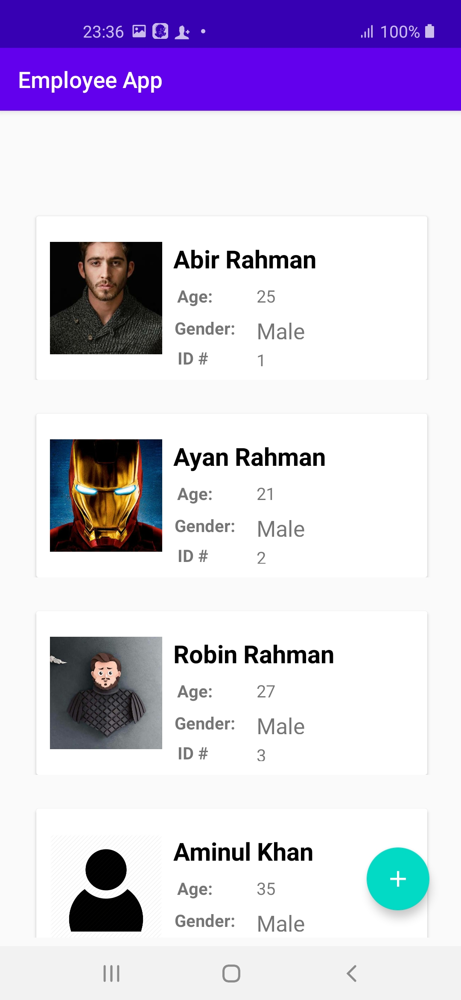
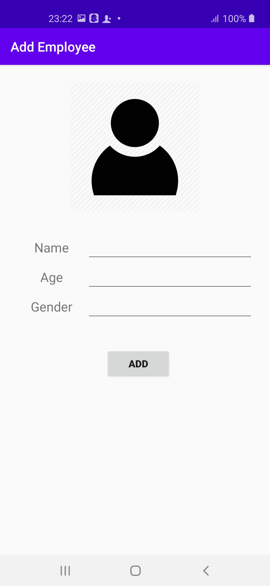
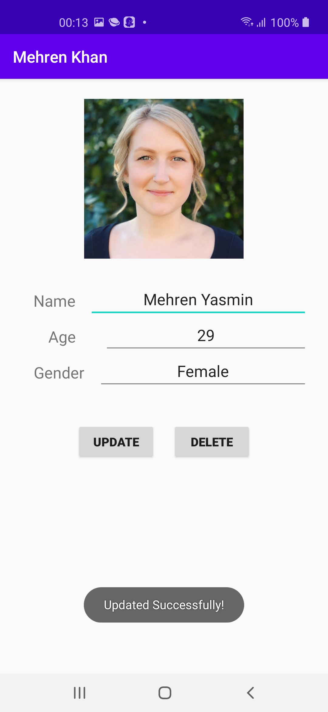
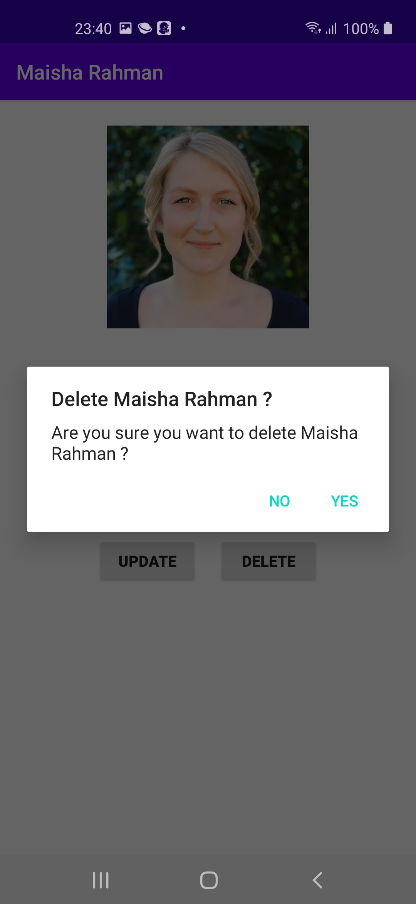

# Employee Database

To run the sample project, you will need Android Studio installed. 
1. Clone sample project from git hub: https://github.com/AbirRahmanOne/EmployeeDatabase
2. Open and run in Android Studio

I have used GligarPicker for selecting image from device galary.
 Link # @https://github.com/OpenSooq/Gligar

This employee app  pplication have following features .
- **Add** Employee Data
- **Update** Employee Data
- **Delete** EmployeeData

### HomePade View 

### Add Operation 

### Update Operation 

### Delete Operation 

